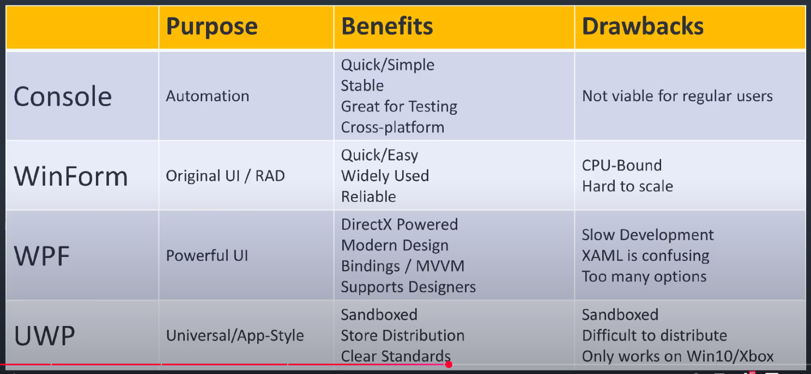

# My GUI Notes

## WinForm vs WPF vs UWP vs Console

Great video decribing the differences between the different GUI frameworks for Powershell

[WinForm vs WPF vs UWP vs Console - The C# Desktop UI Showdown (and the future with .NET 5)](https://youtu.be/yq0dSkA1vpM?si=90uzYkNGJMqxorCN)

## LazyWinAdmin Getting Started Tutorial

[PowerShell GUI – Howto get started](https://lazyadmin.nl/powershell/powershell-gui-howto-get-started/)
